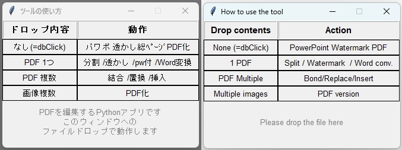

# [PDFkraft](https://github.com/niwakenji/PDFkraft/releases/tag/v1.0.0)
PDFkraft is a Python-based tool for manipulating PDF files — merging, splitting, watermarking, image insertion, and more.  
Just drag and drop files onto the interface to use the tool.
To prevent accidental file deletion, PDFkraft is designed to always generate new output files.  ※ This tool is designed for Windows only.

PDFkraftは、PDFの結合・分割・透かし追加・画像挿入・Word変換などを行うPython製ツールです。
インタフェースに、ファイルをドロップして使います。
誤ってファイルを消さないよう、出力ファイルは新しく生成される仕様です。
※ Windows 専用ツールです。  




---

## ✨ Features / 主な機能

- ✅ **Merge and split PDFs**  
　PDFの結合・分割

- ✅ **Extract or replace specific pages**  
　特定のページを抽出・差し替え

- ✅ **Add watermark text to each page**  
　各ページに透かし文字を追加

- ✅ **Insert JPG images into a PDF**  
　JPG画像をPDFに挿入

- ✅ **Convert PDF to Word (.docx)**  
　PDFをWord（.docx）ファイルに変換

- ✅ **Define frequently used operations and make them repeatable.**  
  よく使う操作を定義し、繰り返し実行可能

---

## 🚀 Getting Started / はじめかた

Place `PDFkraft.py` and `language.json` in the same folder and run:  
`PDFkraft.py` と `language.json` を同じフォルダに置いて、以下のように実行してください：

```bash
python PDFkraft.py
```

Or, if you're using the executable version, Place PDFkraft.exe and language.json in the same folder and double-click to run.
または、実行ファイル版を使う場合は、PDFkraft.exe と language.json を同じフォルダに置いてダブルクリックで実行してください。  


---

## 🌐 Language Support / 言語対応

- English
- Japanese
- German
- French
- Spanish

The interface language is selected based on the `"language"` key in `language.json` (choose from `en`, `de`, `fr`, `es`, `ja`).  
If the file is missing or invalid, Japanese will be used as fallback.

表示言語は `language.json` の `"language"` キーによって選ばれます（`en`、`de`、`fr`、`es`、`ja` から選択）。  
ファイルが存在しない場合や読み込めない場合は、日本語が既定で使用されます。

---

## 📦 Requirements / コンパイルに必要なパッケージ

For running from source:  
ソースから実行する場合の依存パッケージは以下の通りです。

See [`requirements.txt`](./requirements.txt) for installation.  
インストールには [`requirements.txt`](./requirements.txt) をご利用ください。


---

## 👤 Requirements / コンパイルに必要なパッケージ

Kenji Niwa
[Koromokkuru lab](http://netyama.sakura.ne.jp/db/db.cgi?folder=kuruma)

---
